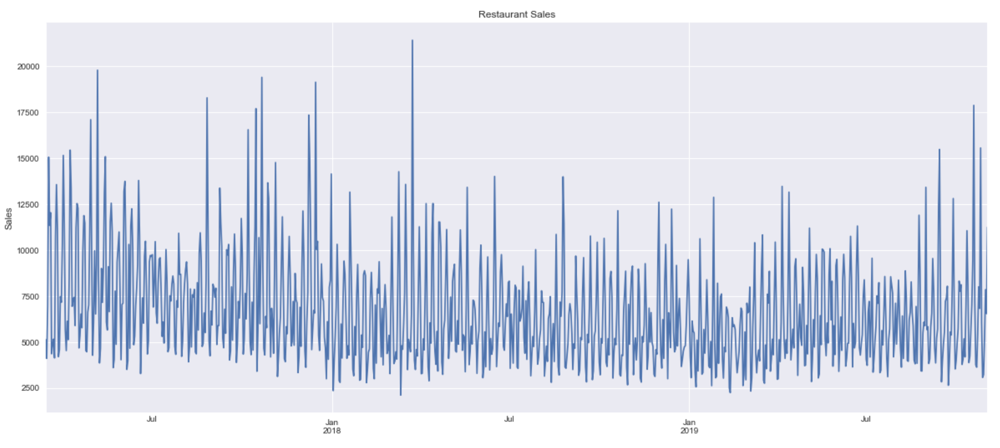
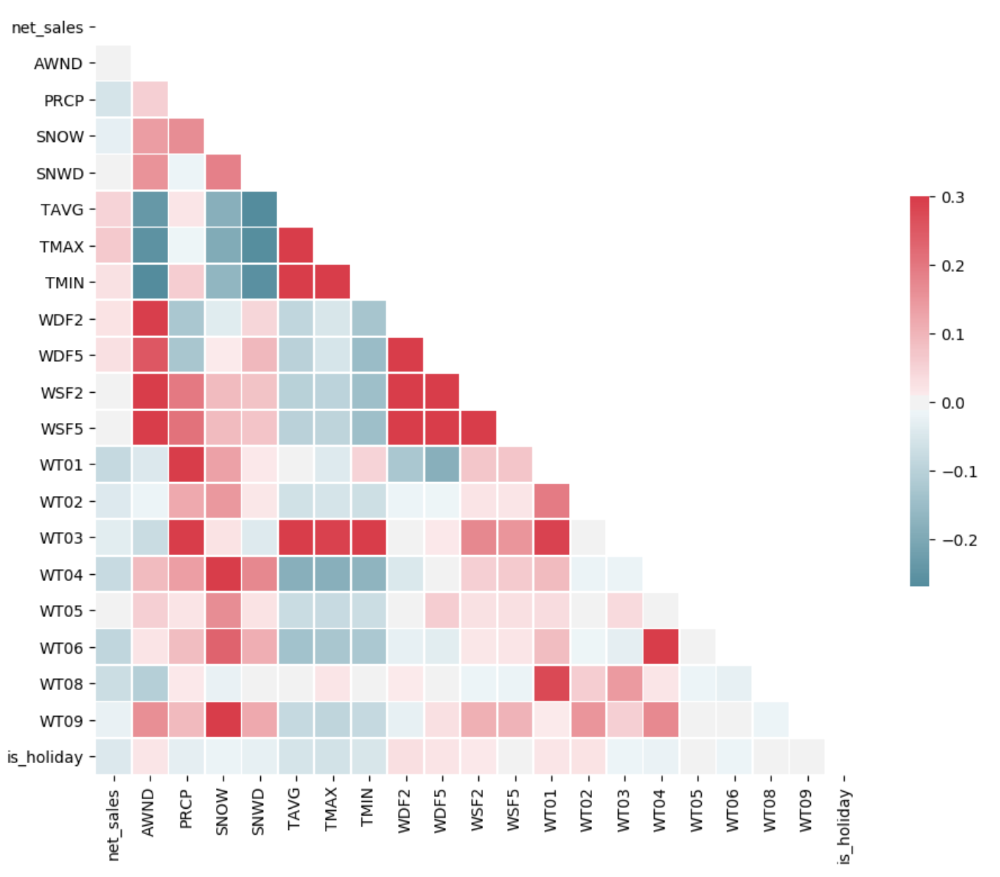
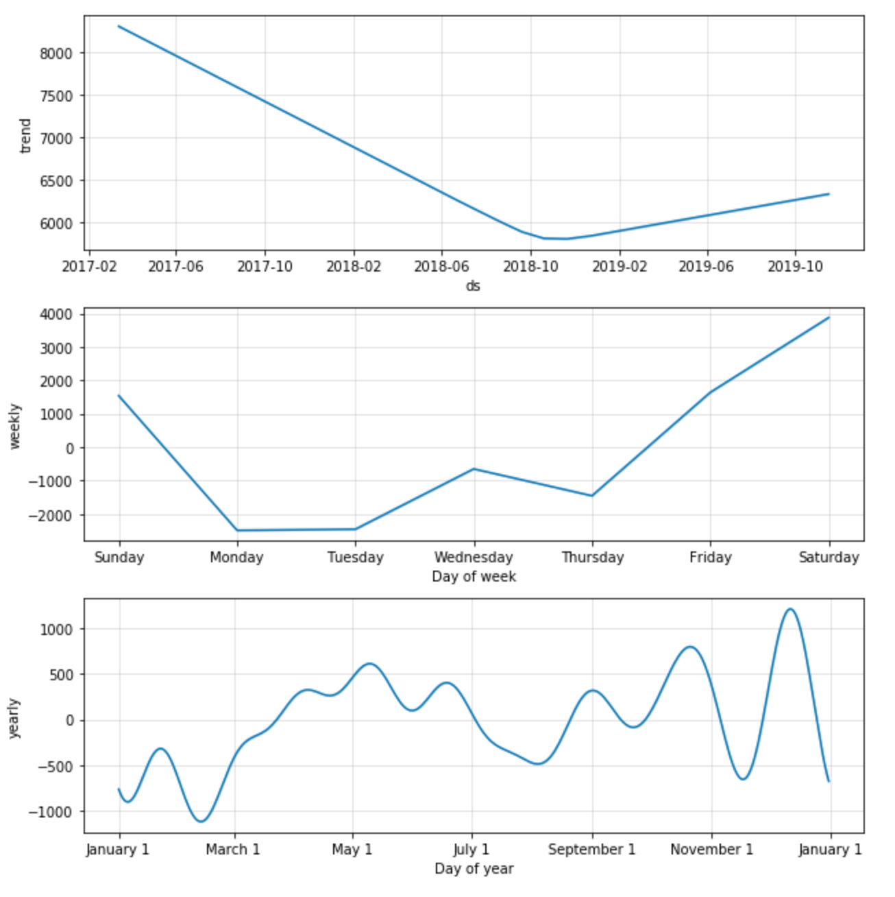
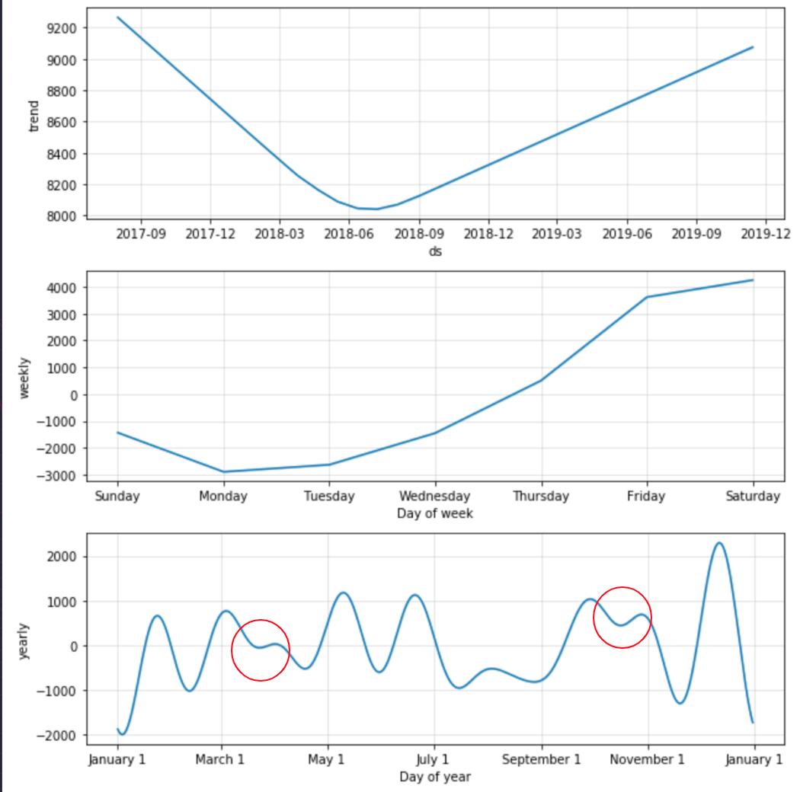
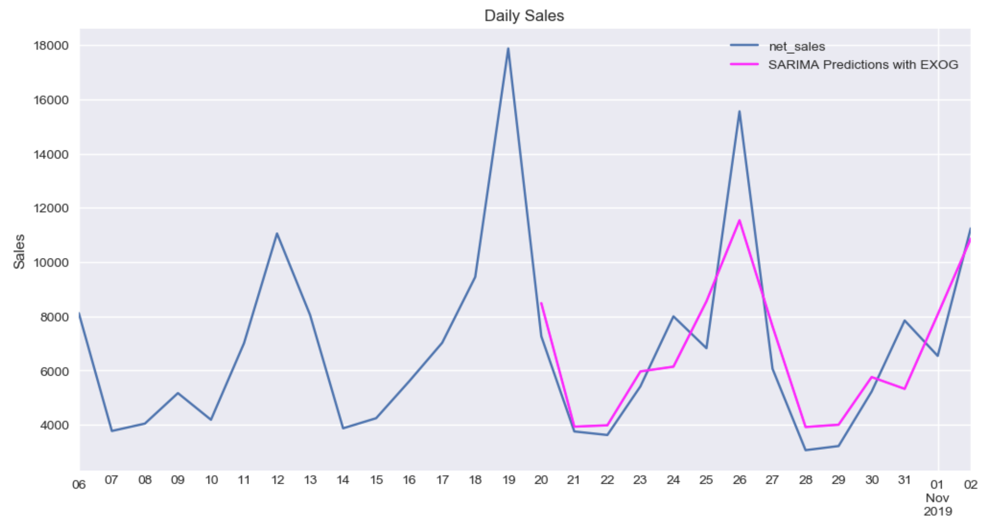
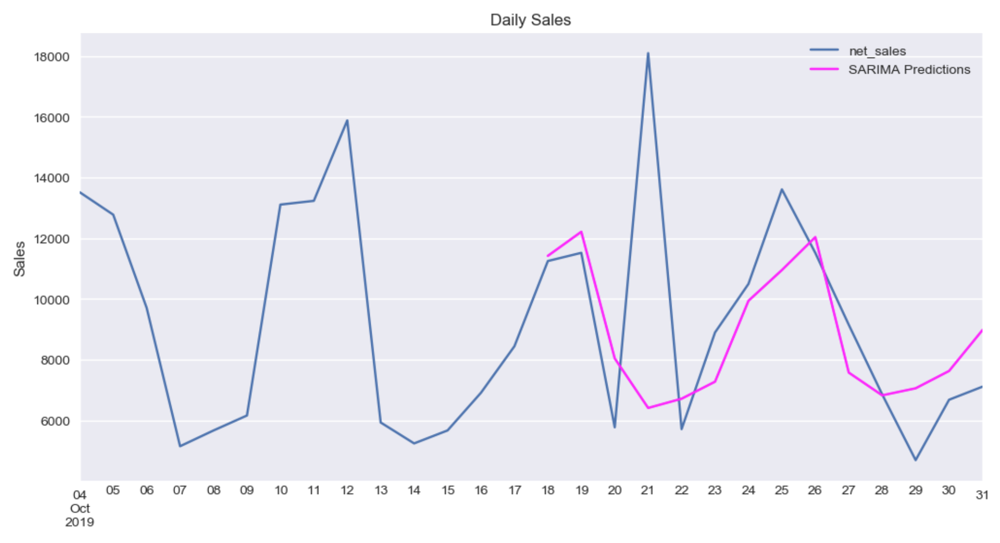

# Restaurant Sales Analysis
Sarah Smith
- [Data](#data)
- [EDA](#eda)
- [Model](#model)
- [Conclusions](#concl)

## Project Goals
The goal of this project is to utilize time series analysis on restaurant sales, using additional exogenous variables, to predict daily sales.

## Data Collection 
I received 2.5 years of daily sales from two restaurants in Brooklyn. I also obtained weather data from [NOAA](noaa.gov).

## EDA
I began with some simple EDA, taking a look at the overall sales for the year:

I then took a look at the correlation between my exogenous variables and the sales as a quick visual for how they may affect the sales.

Next, using the Facebook Prophet model I decomposed the sales to see daily, weekly and yearly sales trends.
Knowing that the restaurant has a trivia night on a Wednesday, you can see that it is positively affecting sales on that day. 

Looking at the second restaurant, it has a trivia night on a Monday and we do not see the same peak in sales on that day as with the first restaurant, this is a possible area for the business owner to address.
Also when looking at the yearly trends, other than the obvious dips at quiet times of the year, I have identified two smaller dips as possible 'low-hanging fruit' for times to increase sales.

## Model 
Optimizing for lowest RMSE I chose a SARIMAX model.
Here you can see the predictions for the first restaurant, which have an RMSE of 1623.71.

When looking at the second restaurant, the prediction misses one of the days due to an anomaly of a private event that day.
I quickly realized that the model would need 'private events' as an exogenous variable.

## Conclusions & Further Work 
- The overall trends show actionable insights for the business
- The final model can predict up to two weeks in advance within an acceptable error rate
- Private events will need to be added to improve the model
